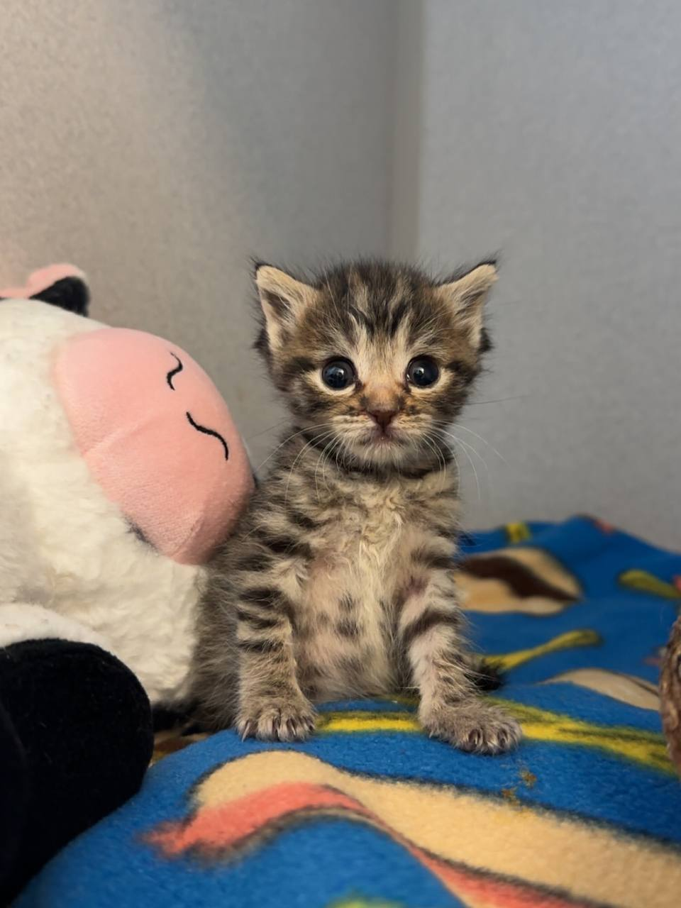

  

<h1 align="center">👋</h1>

 i code for fun sometimes   <b>i code in:  </b> 

  
  
  
  
  
  
  
  

<h2 align="center"><b>donations / payments</b></h2>

| **bitcoin** || [bc1qf6hjyw6pkf2a97rcwn3xrpzjl9w6pn076phfgx](bitcoin:bc1qf6hjyw6pkf2a97rcwn3xrpzjl9w6pn076phfgx) |
|-------------|------------------------------------------------------------------------------------------------------------------------------------------|------------------------------------------------------------------------------------------------------------------------------------------|
| **monero**  || [498nePfGjhoPaq61a8LcFNivB5x5mUs5y4FKD5BJ3a5TTg8uNHiMcsECzGJHPVxeA9jfq3MvAz66JYecSu92ZCyH5dFbu5t](monero:498nePfGjhoPaq61a8LcFNivB5x5mUs5y4FKD5BJ3a5TTg8uNHiMcsECzGJHPVxeA9jfq3MvAz66JYecSu92ZCyH5dFbu5t) |

<h2 align="center">contact me</h2>

| **signal**   |  | [@law.73](signal:law.73) |
|--------------|----------------------------------------------------------------------------------------------------------|----------------------------------|
| **discord**  |  | [@qzjq](https://discord.com/users/qzjq) |
| **telegram** |  | [@thighhh](https://t.me/thighhh) |
| **simplex**  |  | [link](https://smp18.simplex.im/a#aOsNDL750I8qzVG0jQoiGD_J2MokOV8OjBf34ng076E) |
| **email**    |  | [cseven@cock.li](mailto:cseven@cock.li) |

<small style="color:#888">im on more platforms im just too lazy to link them here</small>

